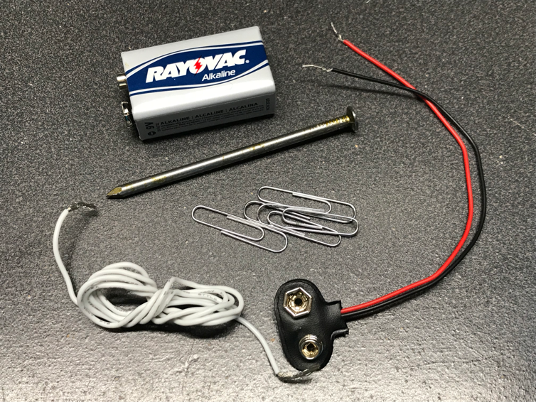
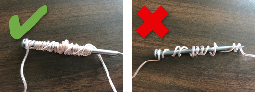
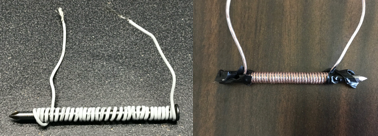
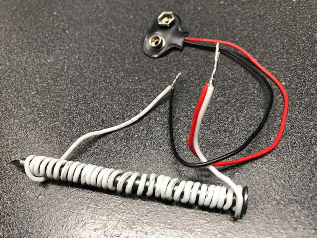
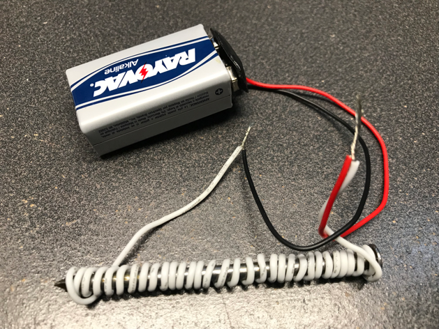

# Magnets all around us!

Magnets are hidden in everyday use all around us. We use them to generate electricity, and drive our cars. Magnets are so simple, yet so incredibly important for modern life. They are hidden all around us. Come to this session to learn how magnets work, and even how to build your own electro-magnet with a nail, wire, and a small battery you can probably find around your house.

This is presented as a Family session at [That Conference](http://thatconference.com) to help teach STEM principles. It's presented by the Pietschmann family (Katie, [Chris](http://pietschsoft.com), and Kids).

It's been presented in the following years of That Conference:

- [That Conference 2019 - Magets all around us!](https://www.thatconference.com/Sessions/Session/13803)
- [That Conference 2018 - Magets all around us!](https://www.thatconference.com/sessions/session/12805)

## Supplies

Here's what you'll need:

- a 9V battery
- a couple small paper clips
- 1 nail - about 2 1/2 to 3 inches long
- about 4 1/2 feet of insulated copper wire with 1/2 inch of insulation stripped off both ends
- 9V battery connector with 1/2 inch of insulation stripped off each wire

## Instructions

1. Take the Nail and the Copper Wire, and start wrapping the wire around the nail in a coil, starting at the head of the nail. Be sure to leave a couple inches of wire hanging off the nail head so it can be connected to the battery connector.

    

1. Coil the wire around the nail tightly. Make sure to not leave any gaps between winds of the wire. The more times you wind the wire around the nail the stronger the electro-magnet will be.

    

1. Wind the wire until there’s a couple inches of wire hanging off each end. If necessary, use some tape to hold the wire on the nail. 

    

1. Twist each end of the wire on the nail to the wires on the 9V battery connector.

    

1.	Connect the 9V battery to the connector to turn the nail into an electro-magnet!

    

    > Note: Be sure not to let the twisted wire ends touch as that will short circuit the battery and prevent the magnet from working. A little tape could be used on one of them to help prevent this.

1. Pick up the nail and try picking up the paperclips with it. When connected to the battery it will be turned into an electromagnet. Disconnecting one of the wires from the battery will cause the nail to lose its magnetism again.

1. **When finished, be sure to disconnect the battery**, so you can play again later. Leave it disconnected when not playing so you don’t drain the battery
